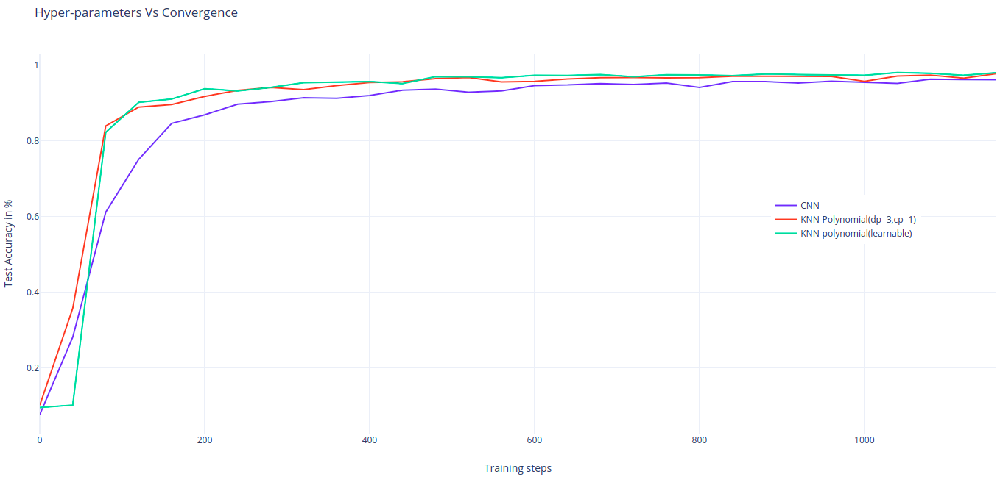
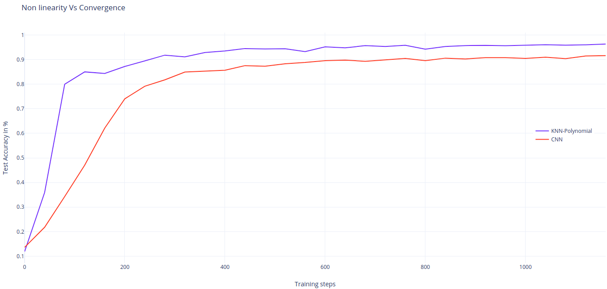

# Kervolutional Neural Networks
A Tensorflow implementation of the [Kervolutional Neural Networks (KNN)](https://arxiv.org/pdf/1904.03955.pdf).

### Introduction

The paper introduces an alternative operator to the usual convolution operator in CNNs, called *kernel convolution*.
The key idea is to use non-linear kernels to extract more complexe features without adding any additional parameters.

Using kernels as a source of non-linearity is more effective than using activation functions and max pooling operations (see figure below).

### Implementation

This code was tested using *TF2.0* and *python 3.6*.

```python
pip install -r requirements.txt
```

To launch training using *LeNet5* and *MNIST* dataset as described in section 4 in the paper :
```python
python train_evaluate.py --lr 0.003 --batch_size 50 --epochs 20 --model_name
KNN --kernel polynomial
```

The figures below represent the test accuracy for the first epoch.  
<br />
<div align="center">
 
<br />

For the learnable parameter cp of the polynomial kernal, the initialization of this parameter is important for faster convergence. The curve in the figure below used 0.5 as initial value.

<br />
<div align="center">

<br />

To test the non-linearity impact on the performance, the activations are removed and the max pooling is replaced by an average pooling. These experiments are done using a lower leraning rate (0.0001)

<br />
<div align="center">

<br />

